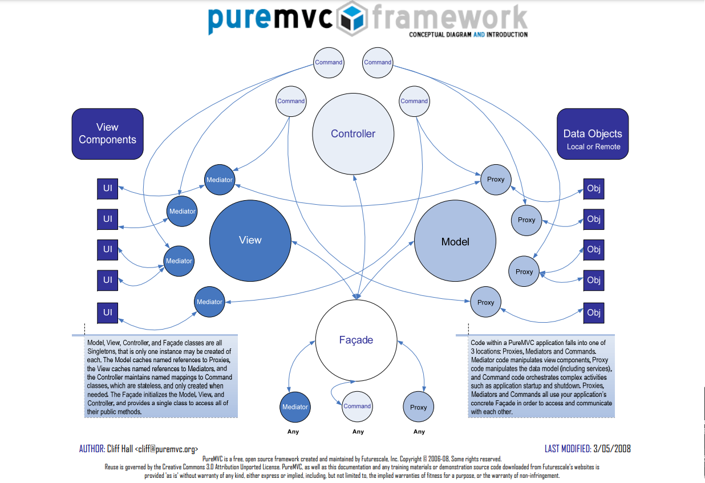

# Model View Controller

+ [PrueMVC](https://puremvc.org/)
    - [Model-View-Controller - wiki](https://zh.wikipedia.org/zh-tw/MVC)

Model-View-Controller ( MVC ) 是常見的互動系統架構樣式，從 MVC 為基礎延伸諸如 [Document-View](https://learn.microsoft.com/en-us/cpp/mfc/document-view-architecture?view=msvc-170)、[MVVM](https://en.wikipedia.org/wiki/Model%E2%80%93view%E2%80%93viewmodel)、[MVP](https://en.wikipedia.org/wiki/Model%E2%80%93view%E2%80%93presenter) 多個架構樣式；而架構設計樣式為概念的設計藍圖，將之實踐的框架依據不同語言皆有不同，本設計參考 PrueMVC 的設計概念，並依據現有語言句型進行調整。


> from [PrueMVC](https://puremvc.org/)

## 引用 MVC 模組

MVC 其模組包括一個 Class。

```js
import Application from "@/framework/pattern/facade/mvc";
```

+ ```Application``` 為繼承 ```Singleton``` MVC 應用程式類別

## MVC 應用程式

#### MVC 為 Singleton

```js
let inst = Application.instance;
let newInst = new Application();
console.log(inst === newInst); // print true
```

MVC 應用程式需為全域唯一物件，確保無論在系統的何處皆可經由唯一物件的介面進行內容操作。

#### MVC 包括三個靜態訪問器

```js
console.log(Application.model); // print Container { contents: {} }
console.log(Application.view); // print Container { contents: {} }
console.log(Application.controller); // print Container { contents: {} }
```

MVC 框架會將相應的類別存儲到相應的容器進行管理。

#### MVC 提供註冊物件

```js
// 註冊 Model
Application.register(new Service());
Application.register(new Proxy());
// 註冊 View
Application.register(new Mediator());
// 註冊 Controller
Application.register(new Command());
Application.register(new Macro());
```

註冊函數會依據物件實作的介面與屬性作型態檢查，並對相應容器進行註冊。

#### MVC 提供移除物件

```js
// 移除 Model
Application.remove(new Service());
Application.remove(new Proxy());
// 移除 View
Application.remove(new Mediator());
// 移除 Controller
Application.remove(new Command());
Application.remove(new Macro());
```

移除函數會依據物件實作的介面與屬性作型態檢查，並對相應容器進行移除。

#### 執行 Model 操作

```js
await Application.op("Proxy-name", "operaton-name", {str: "123", val : 123})
```

操作詳細運用參考 [Proxy](../../proxy) 說明，依據規範建議使用 async/await 句型執行

#### 執行 View 事件

```js
await Application.on("View-name", "event-name", {str: "123", val : 123})
```

事件詳細運用參考 [Mediator](../../mediator) 說明，依據規範建議使用 async/await 句型執行

#### 執行 Controller 命令

```js
Application.exec("Command-name", {str: "123", val : 123})
```

命令詳細運用參考 [Command](../../command) 說明，依據規範建議使用 async/await 句型執行

#### 執行通告

```js
Applicaation.notify("Model | View name", "event-name", {str: "123", val : 123})
```

因 Model 與 View 模組有使用到觀察者，因此，通告詳細運用參考 [Observer](../../observer) 說明。
