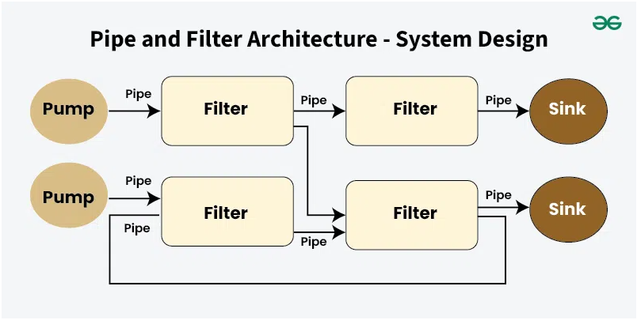

# Progress

+ [Pipeline - wiki](https://en.wikipedia.org/wiki/Pipeline_(software))
    - [Pipe and Filter Architecture - System Design](https://www.geeksforgeeks.org/pipe-and-filter-architecture-system-design/)
    - [Pipes and Filters Architecture](https://www.slmanju.com/2020/05/pipes-and-filters-architecture.html)
    - [軟體架構模式（2）：Pipes and Filters](https://teddy-chen-tw.blogspot.com/2016/11/2pipes-and-filters.html)

管道與過濾器架構 ( Pipe and Filter Architecture ) 是一種架構設計樣式，其概念是將一個流程劃分為不同的步驟的過濾器，透過稱為管道的通道連接。每個過濾器專用於特定的處理功能，無論它涉及轉換、驗證或聚合資料。資料透過管道流過這些過濾器，將一個過濾器的輸出傳送到另一個過濾器的輸入。

因為每個過濾器獨立運作並專注於單一功能，使得此架構具有模組化、可復用性，並允許過濾器在不同的系統或應用程式中使用。


> from [Pipe and Filter Architecture - System Design](https://www.geeksforgeeks.org/pipe-and-filter-architecture-system-design/)

此架構因其流程管理的概念，廣泛運用在諸如加解密工具、圖形渲染工具、人工智慧演算法系統、.NET Core 核心框架等；在互動系統中，管道與過濾器架構則用於場景與動畫管理，本項目稱此為 Progress 框架 ( 進程框架 )。

Progress 框架會基於管道與過濾器 架構為概念，並依賴命令設計樣式為基礎其流程管理，實務項目規劃如下：

+ 過濾器 ( Filter ) 繼承簡易命令 ( Command Command )
+ 管道 ( Pipe ) 繼承非同步巨集命令 ( AsyncMacro command )
    - 管道預設情況下依據註冊的過濾器名稱，依序名稱順序執行
    - 管道可以透過藍圖規劃註冊的過濾器執行流程
        + 藍圖中的每個節點 ( node ) 其輸入、輸出為多對多
        + 若節點有多個輸入節點，可依據輸入節點的執行狀態是否執行
            - 設定為 ```or```，任一輸入節點完成，本節點就執行
            - 設定為 ```and```，所有輸入節點皆完成，本節點才執行
    - 管道中的過濾器可以經由管道控制器物件改變下個要執行的過濾器
    - 流程控制藍圖，透過 Pipe 建置 Filter 時規劃其中的流程與關係

## 引用 Progress 模組

Progress 其模組包括兩個 Type、四個 Interface、三個 Class。

```js
import { TPipeBlueprintOptions, TPipeBlueprint, IFilter, IPipe, IPipeController, IProgressNotify, Filter, Pipe, Progress } from "@/framework/pattern/facade/progress";
```

+ ```TPipeBlueprint``` 為藍圖物件的型態
+ ```TPipeBlueprintOptions``` 為藍圖選項物件的型態
+ ```IFilter``` 為繼承 ```ICommand``` 的過濾器介面，
+ ```IPipe``` 為繼承 ```ICommand```'、```IContainer<ICommand>``` 的管道介面
+ ```IPipeController``` 為管道控制介面
+ ```IProgressNotify``` 為進程通告介面
+ ```Filter``` 為繼承 ```Command``` 命令，並實作 ```IFilter``` 的過濾器類別
+ ```Pipe``` 為繼承 ```AsyncMacro``` 命令，並實作 ```IPipe``` 的管道類別
+ ```Progress``` 為繼承 ```Pipe```，並實作 ```IPublisher``` 的進程類別

## Progress 框架

#### 管道與過濾器

管道與過濾器在設計樣式來看，上是一種命令與巨集的實作延伸，因此其基本操作與命令樣式有相同的用法

```js
let f1 : IFilter = new Filter();
let f2 : IFilter = new Filter();
let p : IPipe = new Pipe();
p.register("node1", f1);
p.register("node2", f2);
let res : any = await p.exec();
```

#### 配置管道藍圖

若說管道與巨集的差異，就是管道允許過濾器基於藍圖規話運作流程；但倘若未配置藍圖，則依據過濾器註冊名稱，按順序依序執行過濾器。

管道藍圖，用來配置所也節點的輸入與輸出關係，配置規範如下述：

```js
// { "in": [output-node-name], [node-name] : [output-node-name], ..., [node-name] : "out" }
let bp : TPipeBlueprint = {
  "in" : [ "n1", "n2" ],
  "n1" : "n3",
  "n2" : "n3",
  "n3" : "out"
}
```

+ 關鍵字 ```in``` 必須存在，此關鍵字表示管道開始執行時指向的節點
+ 輸出值 ```out``` 必須存在，節點指向此數值，表示該節點的輸出為管道執行結果的內容
+ 節點名稱為實際註冊在管道的過濾器
+ 若執行時節點無法找到註冊的過濾器，則會基於 ```IPipeController``` 發出失敗訊息


管道藍圖選項，當節點有多輸入源時會需要設定，配置規範如下述：

```js
// { [node-name] : [ and | or ( default ) ] }
let bpo : TPipeBlueprintOptions = {
  "n3" : "and"
}
```

+ ```or``` 表示任一個輸入節點更新就執行
    - 參考前述藍圖規話，則 ```n3``` 會在 ```n1```、```n2``` 執行完畢後被執行
    - 此數值為所有節點的預設值
    - 多少輸入節點，該節點會執行多少次數
+ ```and``` 表示所有節點更新才執行
    - 參考前述藍圖規話，則 ```n3``` 會在 ```n1```、```n2``` 皆執行完畢後執行
    - 無論多少輸入節點，該節點只會執行一次

管道配置藍圖與藍圖選項範本如下：

```js
let p : IPipe = new Pipe();
p.blueprint(bp, bpo);
```

#### 巢狀管道

管道可註冊的對象為實作 ```ICommand``` 的類別；因此，可包括 ```Command```、```Macro```、```AsyncMacro```、```Filter```、```Pipe```、```Progress``` 這些類別。

```js
let f1 : IFilter = new Filter();
let f2 : IFilter = new Filter();
let p1 : IPipe = new Pipe();
let p2 : IPipe = new Pipe();
let p : IPipe = new Pipe();
p1.register("1", f1);
p1.register("2", f2);
p2.register("1", f1);
p2.register("2", f2);
p.register("1", p1);
p.register("2", p2);
```

倘若巢式管道中的子管道執行失敗時，整個管道皆為失敗。

#### 管道執行

管道執行時需注意兩個事項：

```js
let p : IPipe = new Pipe();
let res : any = await p.exec({str : "123", val : 321});
```

+ 執行需要提供一個參數物件，若不提供則以空物件傳遞。
+ 執行時需使用 ```await``` 關鍵字，整個管道設計皆使用非同步執行，過濾器可依 ```exec``` 函數內容執行狀況來調整

#### 管道管理器

若管道中的過濾器要改變當前管道的執行狀態，則需使用管道管理器物件。

```js
interface IPipeController {
    goto ?: string;
    fail ?: boolean;
    data ?: any;
}
class filter {
    exec($args : any) : any {
        let pc : IPipeController = { "goto": "node1", "data" : {str: "123", val: 321} }
        return pc;
    }
}
```

管道管理器物件建議宣告為實作 ```IPipeController``` 的物件，並作為執行結果回傳給管道，當前管理器主要包括兩個功能：

+ 節點跳躍
    - 設定 ```goto``` 與 ```data``` 兩個參數
    - 管道會清除當前的執行柱列
    - 將 ```goto``` 指向的節點視為下個要執行的節點
    - 將 ```data``` 指向的內容視為下個節點執行時的輸入參數
    - 倘若無法找到指向的節點，會發出控制失敗
+ 控制失敗
    - 設定 ```fail``` 或 ```data``` 兩個參數
    - 管道會清除當前的執行柱列
    - 若有 ```data```，將其內容組成錯誤訊息

#### 進程

進程是一種管道的延伸設計，期規劃包括如下：

+ 複合 Publisher 類別，並實作 IPublisher 介面
+ 執行進程時，會固定發送事件
    - onStart：當進程開始執行第一個節點前發出事件
    - onComplete：當進程執行完所有節點後發出事件
    - onError：當進程執行失敗時發出事件

```js
let onStart = (note : IProgressNotify) => {};
let onComplete = (note : IProgressNotify) => {};
let onError = (note : IProgressNotify) => {};
let p : Progress = new Progress();
p.attach("onStart", onStart);
p.attach("onComplete", onComplete);
p.attach("onError", onError);
```

對管道註冊事件範本如上，當管道發生事件，會實作 ```IProgressNotify``` 介面的物件作為參數傳入。

```js
interface IProgressNotify {
    progress : Progress;
    args ?: any;
    result ?: any;
}
```

+ ```progress``` 為發出事件的管道本身
+ ```args``` 為管道執行時的輸入參數物件身
+ ```result``` 為管道執行時的輸出參數，在 ```onComplete``` 為執行結果，```onError``` 為失敗訊息

## 設計議題

為應對非同步執行問題，Progress 執行過濾器有兩種方式：

+ 使用 Iterator.next 概念，讓過濾器取得 Iterator 並決定何時執行。
+ 使用 async / await 概念，讓過濾器自行 await 到動作完成。

現行方式才用 async / await 概念。

這兩者沒有絕對的優劣，前者的設計方式在提供控制器讓過濾器控制，但若整個過程單線且無非同步則會因需撰寫 next 指令使得程式冗餘，後者的設計則需要配合 async / await 的句型撰寫，若撰寫錯誤則會直接略過動作而超出執行預期。
